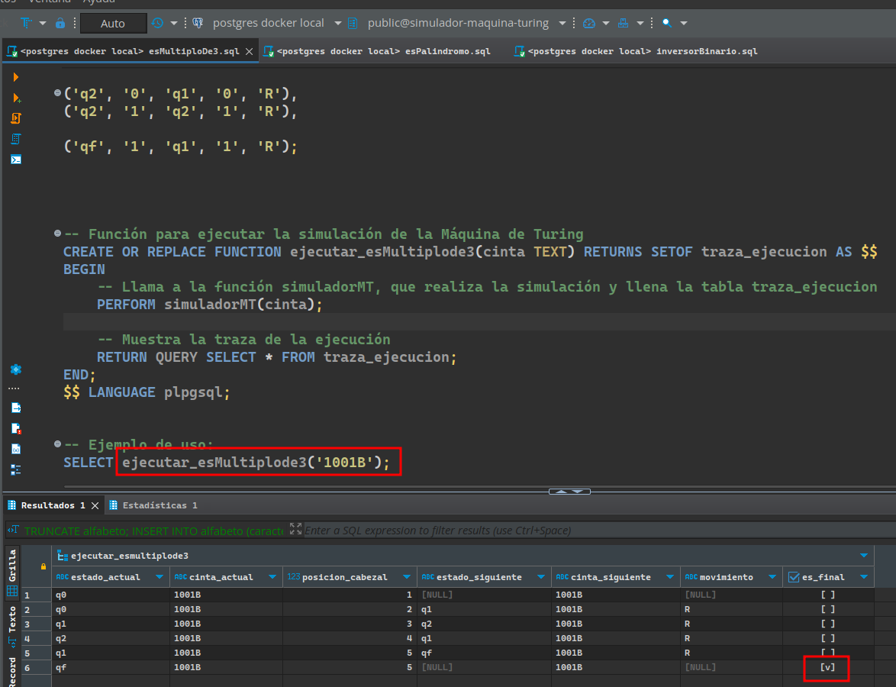
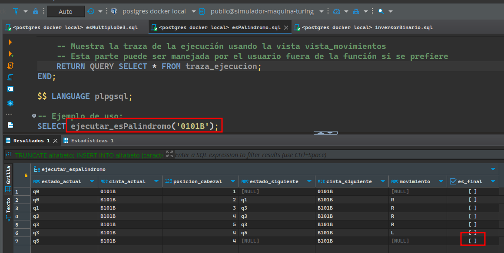
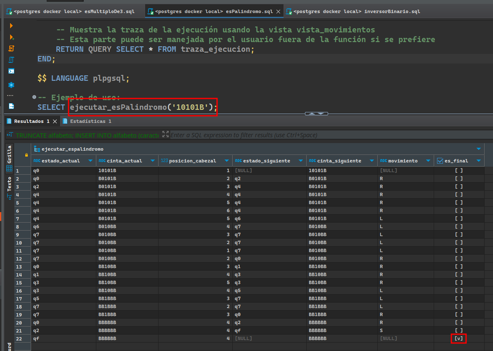
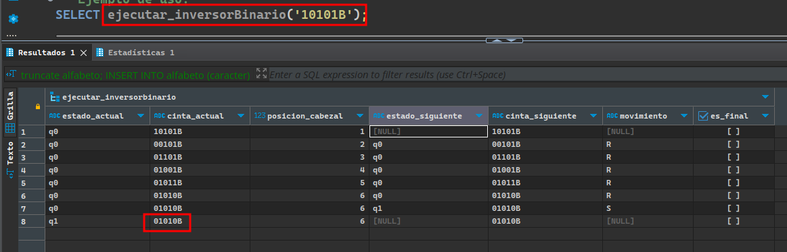

Trabajo práctico final de Teoría de Computación, Universidad Nacional General Sarmiento, primer semestre 2024.


Este trabajo práctico tiene como objetivo desarrollar un simulador de máquinas de Turing. Este simulador debe ser capaz de tomar la definición de una máquina de Turing, ejecutarla con un _string_ de entrada y registrar cada uno de los movimientos en una base de datos para análisis posterior. Para la implementación, se utilizará _PostgreSQL_ con programación en _pl/pgsql_. Es esencial preparar el entorno adecuado y garantizar que todas las dependencias necesarias estén instaladas, incluyendo Docker para el manejo de contenedores donde se ejecutará _PostgreSQL_. A continuación, se describen los pasos para configurar el entorno necesario para este proyecto.

### Instalación de Docker 🐋 en Ubuntu 24.04 LTS

Primero, es necesario instalar Docker, que nos permitirá manejar contenedores donde se ejecutará la base de datos PostgreSQL. Los siguientes comandos instalarán Docker y configurarán el entorno necesario:

```bash
sudo apt update
sudo apt install -y ca-certificates curl
sudo install -m 0755 -d /etc/apt/keyrings
sudo curl -fsSL https://download.docker.com/linux/ubuntu/gpg -o /etc/apt/keyrings/docker.asc
sudo chmod a+r /etc/apt/keyrings/docker.asc
```

Este conjunto de comandos actualiza tus paquetes, instala certificados necesarios, crea un directorio para llaves y descarga la llave GPG de Docker en el sistema.

Añade el repositorio de Docker a las fuentes de APT del sistema:

```bash
echo \
  "deb [arch=$(dpkg --print-architecture) signed-by=/etc/apt/keyrings/docker.asc] https://download.docker.com/linux/ubuntu \
  $(. /etc/os-release && echo "$VERSION_CODENAME") stable" | \
  sudo tee /etc/apt/sources.list.d/docker.list > /dev/null
sudo apt update
```

Instala los paquetes de Docker:

```bash
sudo apt install -y docker-ce docker-ce-cli containerd.io docker-buildx-plugin docker-compose-plugin
```

Asigna permisos al usuario para ejecutar Docker sin ser _sudo_:

```bash
sudo groupadd docker
sudo usermod -aG docker $USER
newgrp docker
```

Configura el arranque automático de los servicios de Docker:

```bash
sudo systemctl enable docker.service
sudo systemctl enable containerd.service
```

Verifica la instalación ejecutando el siguiente comando para listar todos los contenedores activos:

```bash
docker ps
```

### Instalación de Portainer (Opcional)

Portainer facilita la administración de contenedores a través de una interfaz gráfica. Para instalar Portainer, usa el siguiente comando:

```bash
docker run -d -p 8000:8000 -p 9443:9443 --name portainer --restart=always -v /var/run/docker.sock:/var/run/docker.sock -v portainer_data:/data portainer/portainer-ce:latest
```

Accede a Portainer a través de tu navegador en `https://localhost:9443/`.

### Instalación de Postgres en Docker

Crea un contenedor de Postgres dentro de Docker con el siguiente comando:

```bash
docker run -d -p 5432:5432 --name=postgres-container -e POSTGRES_PASSWORD=pass postgres:latest
```

Cambia "pass" por una contraseña más segura para proteger tu base de datos.

Esto habilita una conexión a una base de dato de postgres, podemos conectarnos con la siguiente información (yo uso Dbeaver para ver bases de datos):


Aclaración: El nombre de la base de la base de datos por defecto es: postgres. Debería ir ese nombre en su conexión la primera vez, luego si crea otra base de datos para esto, puede editar la conexión tal como se ve en la imagen.

Con estos pasos, tu entorno estará preparado para el desarrollo del simulador de máquinas de Turing, utilizando tecnologías modernas y eficientes como Docker y PostgreSQL.

### Desarrollo del Proyecto

En esta sección se detallará el proceso de desarrollo del simulador de máquinas de Turing, incluyendo la creación de las tablas, la implementación de la función simuladora y la construcción de tres programas específicos.

#### Configuración Inicial: `setup.sql`

El archivo `setup.sql` se encarga de la creación de las tablas necesarias en la base de datos. Este script define la estructura fundamental que permitirá registrar y analizar los movimientos de las máquinas de Turing. Las tablas incluyen:

- **Estados**: Define los estados posibles de la máquina.
- **Transiciones**: Detalla las reglas de transición de la máquina de Turing.
- **Cinta**: Almacena el contenido de la cinta en cada paso de la simulación.
- **Traza de ejecución**: Registra cada movimiento y cambio de estado durante la simulación.

Para ejecutar este script, se debe conectar a la base de datos PostgreSQL y correr el comando:

```sql
\i setup.sql
```

#### Función Simuladora: `simuladorMT.sql`

El archivo `simuladorMT.sql` contiene la definición de la función principal que simula la ejecución de una máquina de Turing. La función toma como parámetros la definición de la máquina y una cadena de entrada, y procesa la entrada según las reglas definidas, registrando cada movimiento en la tabla `traza_ejecucion`.

Esta función se implementa en PL/pgSQL y realiza los siguientes pasos:

1. **Inicialización**: Configura el estado inicial, y todas las variables necesarias.
2. **Ejecución**: Iterativamente aplica las transiciones hasta alcanzar un estado de aceptación, rechazo o que se detenga porque no tenga una transición definida.
3. **Registro**: Cada paso y cambio de estado se registra en la tabla `traza_ejecucion` para su análisis posterior.

Para definir esta función en la base de datos, se ejecuta el comando:

```sql
\i simuladorMT.sql
```

#### Programas Específicos

1. **`esMultiploDe3.sql`**: Este programa define una máquina de Turing que determina si un número binario es múltiplo de 3. La máquina de Turing se define con estados y transiciones específicas para procesar la cadena binaria de entrada y decidir si representa un múltiplo de 3. Si la máquina de Turing termina en un estado final, el número es múltiplo de 3.

Ejemplos de ejecución:



1. **`esPalindromo.sql`**: Este programa configura una máquina de Turing para verificar si una cadena de caracteres binarios es un palíndromo. La definición incluye los estados y las transiciones necesarias para comparar los caracteres desde ambos extremos de la cadena hacia el centro. Si la máquina de Turing termina en un estado final, la cadena es un palíndromo.

Ejemplos de ejecuciones:





3. **`inversorBinario.sql`**: Este programa implementa una máquina de Turing que invierte una cadena binaria. Utiliza estados y transiciones para leer la cadena de entrada y escribirla invertida en la cinta.

Ejemplos de ejecución:


